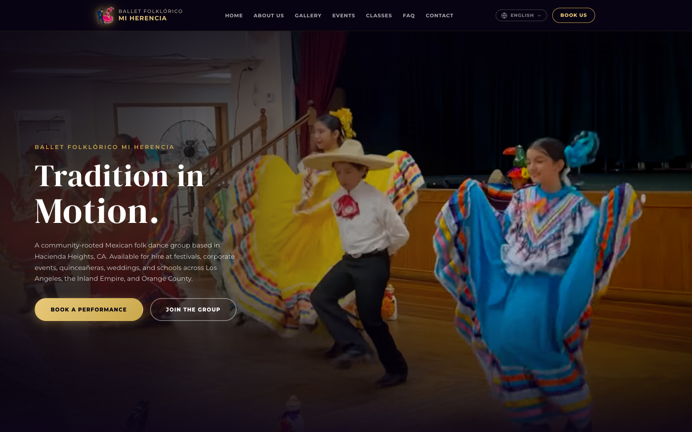

<div align="center">

# Ballet Folklórico Mi Herencia

### Tradition in Motion.

The official site for **Ballet Folklórico Mi Herencia** — the community-rooted Mexican folk dance group I perform with, based in Hacienda Heights, CA. I built and maintain this site for my group, which is available for festivals, quinceañeras, weddings, and corporate events across LA, the San Gabriel Valley, the Inland Empire, and Orange County.

Built as a fast, fully bilingual marketing site with serious local-SEO so the group gets found by people searching "folklorico for hire" in Southern California.

[](https://bfmh.dance)




</div>

## Highlights

- **Multilingual (EN · ES · JA · 简体 · 繁體)** — every language is a real, pre-rendered URL (`/`, `/es/`, `/ja/`, `/zh/`, `/zh-hant/`) with its own `<html lang>`, localized `<title>`/meta, self-referential canonical, and reciprocal `hreflang` tags — the proper way to do multilingual SEO. A language dropdown of real links lets visitors (and crawlers) switch — with JS enabled the swap happens in place (no reload, URL updated via `pushState`); without it the links still work as plain navigation.
- **Safe language auto-detect at the CDN edge** — `vercel.json` redirects first-time visitors on the root `/` to their browser's language before any HTML downloads (zero function invocations — pure routing config, free on Hobby). An explicit switcher choice is remembered (cookie + localStorage) and always wins, the language sub-pages are never auto-redirected (shared links stay intact), and crawlers (en-US) stay on `/`, so SEO is unaffected. An inline script on `/` provides the same detection as a fallback for local dev or non-Vercel hosting.
- **Local SEO, done properly** — descriptive `<title>`, rich meta description and keywords targeting "folklorico for hire" across dozens of SoCal cities, per-language Open Graph + JSON-LD (`DanceGroup`, `FAQPage`, `DanceEvent`), `robots.txt`, and a `sitemap.xml` with `hreflang` alternates.
- **Booking & contact** — an inquiry form wired to [Formspree](https://formspree.io/) so the group can take performance requests without a backend.
- **Performance-first** — hand-built static pages (no framework). Shared CSS (`styles.css`) and JS (`app.js`) are linked once and cached across pages; the language pages are generated from a single source by a tiny dependency-free build script.
- **Analytics, three layers** — Vercel Web Analytics for traffic, Google Analytics 4 for engagement (scroll depth, engagement time, and custom events), and Microsoft Clarity for heatmaps and session recordings. A single shared event helper fires each interaction to both GA4 and Clarity at once, and tags every hit with the visitor's language — so I can see which locales convert and where inquiries actually come from.
- **Booking CTAs** — clear "Book a Performance" and "Join the Group" calls to action, plus sections for About, Events, and Classes.

## Tech & approach

| Concern        | Approach                                                                 |
| -------------- | ------------------------------------------------------------------------ |
| Markup/Styles  | Hand-authored, framework-free **HTML / CSS / JavaScript**                |
| Localization   | `data-i18n` template + `i18n-data.js` dictionary, pre-rendered per URL   |
| SEO            | Per-language meta, Open Graph, JSON-LD, `hreflang`, `robots.txt`, `sitemap.xml` |
| Forms          | Formspree AJAX submissions (no server required)                          |
| Analytics      | Vercel Web Analytics + Google Analytics 4 + Microsoft Clarity (one shared event helper) |
| Hosting        | Vercel — static deploy, instant cache, push-to-deploy                    |

## Where to edit what

Everything shared lives in **one file each** — no styling or behavior is duplicated
across the language pages:

| Edit this…        | …to change                                                       | Rebuild needed? |
| ----------------- | ---------------------------------------------------------------- | --------------- |
| **`styles.css`**  | any styling (shared by all pages, linked not embedded)           | No — refresh    |
| **`app.js`**      | any behavior/JS (shared by all pages)                            | No — refresh    |
| **`i18n-data.js`**| copy & translations + per-language SEO meta (EN/ES/JA/简体/繁體)  | **Yes**         |
| **`index.html`**  | page **structure** (the template; also the English page)         | **Yes**         |

The language pages (`/es/ /ja/ /zh/ /zh-hant/` and the English `index.html`) carry
baked-in translated text for SEO, so they're **generated** — they begin with a
`DO NOT EDIT` banner. Pure CSS or JS changes need no rebuild (those files are
linked); copy or structure changes do.

**`build.mjs`** reads `index.html` + `i18n-data.js` and writes five fully-localized pages:

| URL                    | Lang         | File              |
| ---------------------- | ------------ | ----------------- |
| `https://bfmh.dance/`  | English (x-default) | `index.html` |
| `https://bfmh.dance/es/` | Español    | `es/index.html`   |
| `https://bfmh.dance/ja/` | 日本語      | `ja/index.html`   |
| `https://bfmh.dance/zh/` | 简体中文    | `zh/index.html`   |
| `https://bfmh.dance/zh-hant/` | 繁體中文 | `zh-hant/index.html` |

> ⚠️ The `/es/`, `/ja/`, `/zh/`, `/zh-hant/` pages **and** the English `index.html`
> are generated. After editing copy in `i18n-data.js` or structure in `index.html`,
> **re-run the build** or those pages go stale:
>
> ```bash
> node build.mjs        # no dependencies — pure Node, regenerates all 5 pages
> ```

To preview locally, build first, then serve the folder so the absolute paths and
`/es/` `/ja/` `/zh/` `/zh-hant/` routes resolve:

```bash
node build.mjs
python3 -m http.server 8000   # then visit http://localhost:8000
```

Deployment is push-to-`main` on Vercel; the generated pages are committed and
served as-is (no build step runs on Vercel).
